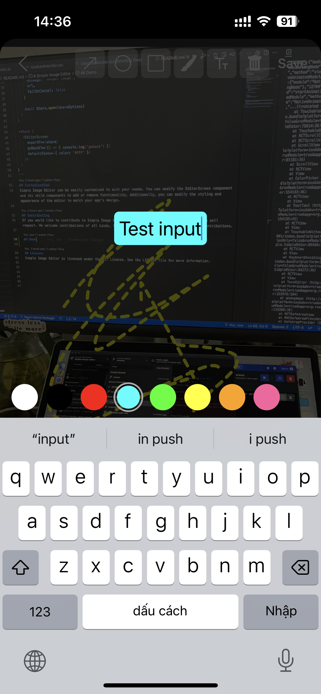

# Simple Image Editor - SE346.N21

## Introduction

Simple Image Editor is a React Native module that allows users to capture and edit images by adding text, drawings, and other effects. It can be easily integrated into other projects and can also be extended with additional features if needed. The module exports images in the form of URLs or base64 strings. You can take a new photo or pass an existing photo through a URL to perform edits.

## Technology

Simple Image Editor is built using the following technologies:

- React Native
- React Native Vision Camera
- React Native Reanimated
- React Native Skia
- React Native Gesture Handler

## Installation

To install Simple Image Editor, follow these steps:

1. Install React Native and set up your development environment.
2. Make sure you have installed all the dependencies listed in the [package.json](https://github.com/SeNyterA/simple-image-editor/blob/master/package.json).
3. Grant camera access permission for both iOS and Android to use the capture image feature.
4. Add import `react-native-gesture-handler` to your `index.js` file.

## Basic Usage

To use Simple Image Editor, copy the `/src` folder of the module into your project and call the `EditorScreen` component while passing the necessary props:

```javascript
import { EditorScreen } from '@yourorg/simple-image-editor'

const App = () => {
  const share = async (url: string) => {
    if (url) {
      const shareOptions: ShareOptions = {
        title: 'Sharing image from awesome drawing app',
        message: 'Output Image',
        url,
        failOnCancel: false
      }

      await Share.open(shareOptions)
    }
  }

  return (
    <EditorScreen
      exportFn={share}
      goBackFn={() => {
        console.log('goback')
      }}
      defaultState={{ color: '#FFF' }}
    />
  )
}
```

## Customization

Simple Image Editor can be easily customized to suit your needs. You can modify the EditorScreen component and its child components to add or remove functionality. Additionally, you can modify the styling and appearance of the editor to match your app's design.

## Contributing

If you would like to contribute to Simple Image Editor, please fork the repository and submit a pull request. We welcome contributions of all kinds, from bug reports to feature requests to code contributions.

## Demo

<div >
  
   
  
  
   
  
</div>


## License

Simple Image Editor is licensed under the MIT License. See the LICENSE file for more information.
